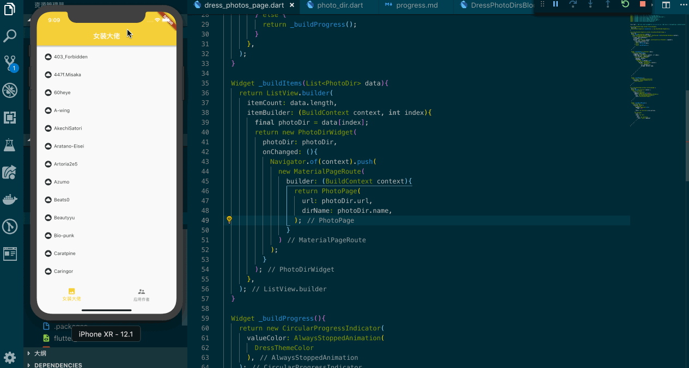
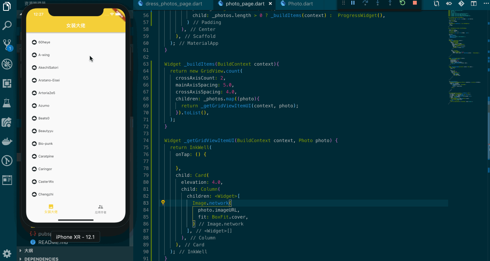

## 进度

这是一份根据应用设计文档而规划的进度完成表格：

**2019/02/18 22:30**

- [x] 实践 Future 和 async
- [x] 实践处理网络请求和数据装载（JSON 和 定义 Author 模型）
- [x] 实践布局 Widget 和 State
- [x] 实践一个范型类来处理 Response
- [x] 实践 Progress 在处理网络请求时提升等待的体验

**2019/02/19 21:30**

- [x] 实践 DressPhotoDirsBlocData 来管理女装大佬列表的目录页面
- [x] 实践简单渲染 ListView Dir Name
- [x] 实践一个抽离的 Widget 传入 photoDir 和 onChanged
- [x] 实践动态路由并且传递两个参数到新的页面

**2019/02/20 00:28**

- [x] 实践 GridView 显示相片

